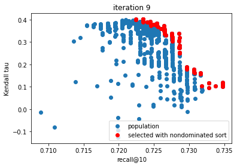

# game_recommender 

Using evolutionary algorithms for multiobjective recommender system 



For results see docs/final_report.pdf

Other than that, the most important notebooks are:

notebooks/Game Metadata Exploration.ipynb

notebooks/Evaluation - Multiobjective Optimization of Hybrid Recommender.ipynb

notebooks/Hybrid Recommendations.ipynb

Notebooks containing implementations of recommenders:

notebooks/Content-Based Recommendations.ipynb

notebooks/User-Based Recommendations.ipynb

## Running this project

```
pip install -r requirements.txt

nbdev_build_lib

pip install .
```

This project uses [nbdev](https://github.com/fastai/nbdev) to build notebooks as Python project.

`nbdev_build_lib` extracts Python sources from notebooks and puts them into `deeplearning_image_classification` directory.


